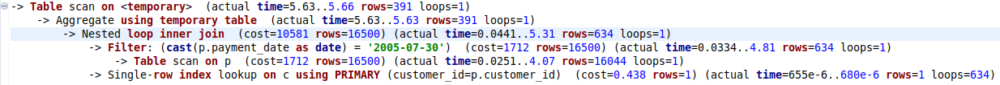

# Домашнее задание к занятию «Индексы» "Макарцев Александр Владимирович"

### Задание 1

Напишите запрос к учебной базе данных, который вернёт процентное отношение общего размера всех индексов к общему размеру всех таблиц.

#### Решение
```
SELECT 
    SUM(index_length)/SUM(data_length)*100
FROM
    INFORMATION_SCHEMA.TABLES;
```


### Задание 2

Выполните explain analyze следующего запроса:
```sql
select distinct concat(c.last_name, ' ', c.first_name), sum(p.amount) over (partition by c.customer_id, f.title)
from payment p, rental r, customer c, inventory i, film f
where date(p.payment_date) = '2005-07-30' and p.payment_date = r.rental_date and r.customer_id = c.customer_id and i.inventory_id = r.inventory_id
```
- перечислите узкие места;
- оптимизируйте запрос: внесите корректировки по использованию операторов, при необходимости добавьте индексы.

#### Решение
Узкие места:

- Из-за того, что используется не JOIN, а просто записано несколько таблиц в FROM, они фактически перемножены. Это приводит к работе с огромной таблицей и потере времени. А также это приводит к тому, что у каждого платежа появляются строки с каждым возможным f.title. И получается, что идёт подсчёт того, сколько каждый человек тратил денег за этот день, дублирующие записи убиваются за счёт distinct, а фильмы в данном запросе не имеют значения.

- Используется over partition by, из-за этого появляются дубликаты записей, которые убирают с помощью distinct. Вместо этого надо использовать group by

Оптимизация запроса:
```
SELECT
    concat(c.last_name, ' ', c.first_name), sum(p.amount)
FROM 
    payment p
JOIN 
    customer c on p.customer_id = c.customer_id
WHERE 
    date(p.payment_date) = '2005-07-30'
GROUP BY 
    c.customer_id
```


## Дополнительные задания (со звёздочкой*)
Эти задания дополнительные, то есть не обязательные к выполнению, и никак не повлияют на получение вами зачёта по этому домашнему заданию. Вы можете их выполнить, если хотите глубже шире разобраться в материале.

### Задание 3*

Самостоятельно изучите, какие типы индексов используются в PostgreSQL. Перечислите те индексы, которые используются в PostgreSQL, а в MySQL — нет.

*Приведите ответ в свободной форме.*

#### Решение

| Индекс | Что это | MySQL |
| --- | --- | --- |
| B-Tree | Поиск в древовидной структуре. | Да |
| Hash | Поиск по вычисляемому hash-значению. | Да |
| GiST | Также использует поиск по дереву, но при этом позволяет работать с такими данными, как текст, геоданные, изображения и т.д. Полученное дерево позволяет проводить поиск с использованием предикатов. Так может возникнуть несколько узлов, которые нужно проверить, и, соответственно, несколько результатов. | Нет, но можно соотнести с R-tree |
| SP-GiST | GiST, предполагающий разбиение на неперекрывющиеся облатсти. В отличие от B-Tree и GiST, представляет собой несбалансированное дерево. | Нет |
| GIN | Ускоряет полнотекстовый поиск.<br> Создаются соответствия. | Нет, похоже на INVERTED |
| BRIN | Позволяет приблизительно найти пространство, в котором нужно искать значение, а остальные пропустить за счёт разбиения всего пространства. Работает, только если данные изначально хранятся в отсортированном виде. | Нет | 
